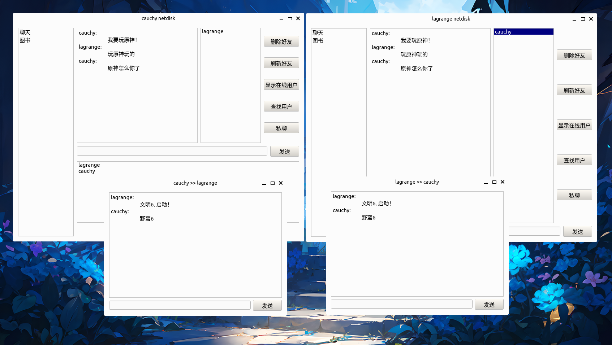

# 基于Qt的网盘项目

一个基于Qt框架的网盘项目, 分为服务端和客户端. 
首先通过登陆/注册/注销账号界面登陆主界面, 登陆主界面后主要包含了聊天和文件两大模块: 

* 聊天: 显示在线用户、查找用户、添加好友、删除好友、好友私聊、好友群聊功能.
* 文件: 创建/删除目录、上传/下载文件、删除文件、移动文件、共享文件、重命名文件功能.

## 环境

* 平台: Ubuntu22.04
* 框架: Qt6.6
* 开发工具: CMake, nvim
* 数据库: sqlite3

## 数据库设计

### `user` 表

| Field | Type | Constraint | Other |
| ----- | ----- | ----- | ----- |
| `id` | `INTEGER` | `PRIMARY KEY` | `AUTOINCREMENT` |
| `name` | `VARCHAR(32)` | `UNIQUE` |  |
| `password` | `VARCHAR(32)` |  |  |
| `state` | `INTEGER` |  | `DEFAULT 0` |

```sql
CREATE TABLE user (
    id INTEGER PRIMARY KEY AUTOINCREMENT,
    name VARCHAR(32) UNIQUE,
    password VARCHAR(32),
    state INTEGER DEFAULT 0
);
```

### `friend` 表

| Field | Type | Constraint | Other |
| ----- | ----- | ----- | ----- |
| `id` | `INTEGER` | `PRIMARY KEY` | `FOREIGN KEY` |
| `friend_id` | `INTEGER` | `PRIMARY KEY` | `FOREIGN KEY` |

```sql
CREATE TABLE friend (
    id INTEGER NOT NULL,
    friend_id INTEGER NOT NULL,
    PRIMARY KEY (id, friend_id),
    FOREIGN KEY (id) REFERENCES user(id) ON DELETE CASCADE,
    FOREIGN KEY (friend_id) REFERENCES user(id) ON DELETE CASCADE
);
```

## 协议设计

```cpp
struct Protocol {
  // 协议长度
  unsigned int length;
  // 协议类型
  unsigned int type;
  // 协议内容
  char data[64];
  // 消息长度
  unsigned int messageLength;
  // 消息
  char message[];
};
```

*注: 这里用`char message[]`而不是`char *message`, 我尝试后得出的原因是: 传递的是一个地址, 
而这个地址在服务器/客户端属于非法地址*

## 通讯思路

分为服务端和客户端两部分, 通过Qt封装好的`QTcpSocket`完成客户端-服务端通信, 客户端-服务端-客户端通信. 
对于客户端的不同请求数据, 都会为其封装一个协议数据包, 通过`socket`发送给服务端. 服务端会根据对应的
协议规则进行解包, 通过数据包中的信息作出响应(如访问数据库、访问文件、转发数据给其他客户端等)
并根据协议规则生成响应数据包, 通过`socket`发送给请求的客户端. 客户端接收数据, 完成一次通讯.

## 主要的类

**服务端**

* `CloudServer`: 继承`QTcpServer`类, 用于服务端启动监听、管理服务端通信`socket`
* `CloudSocket`: 继承`QTcpSocket`类, 用于和客户端进行通信(接收请求、发送响应等).
* `DatabaseOperator`: 用于数据库操作

**客户端**

* `CloudSocket`: 继承`QTcpSocket`类, 用于和服务端进行通信(接收请求、发送响应等).
* `*Widget`: 继承`QWidget`类, 界面以及功能的实现.

## 效果展示

**客户端登陆**


**聊天**



**文件**


**服务端**


